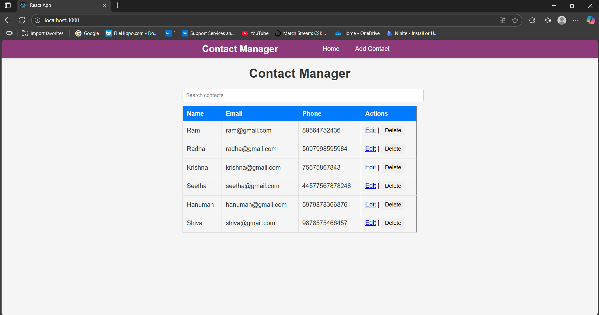
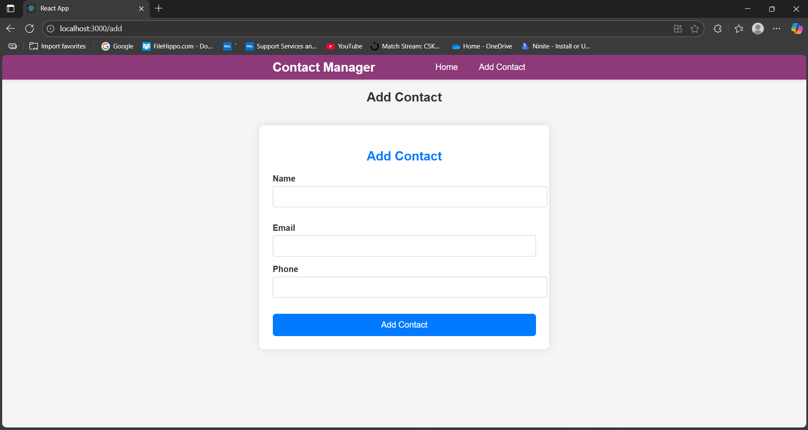
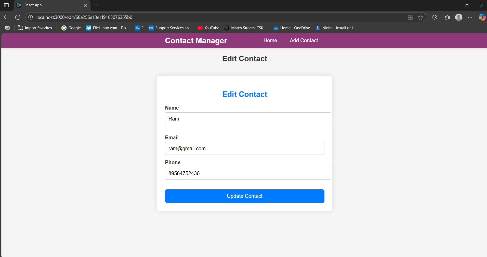
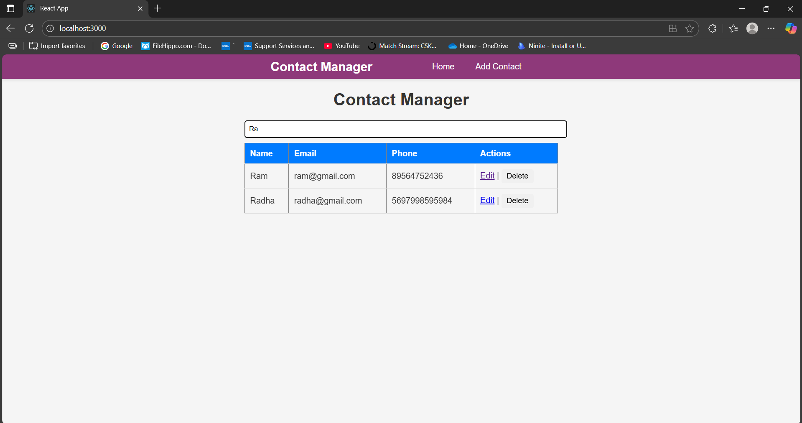

# Contact Manager Application

## Overview

The **Contact Manager** is a full-stack web application built using the **MERN stack (MongoDB, Express.js, React.js, Node.js)**.
It allows users to **add, view, edit, delete, and search contacts**, providing a simple and functional contact management system.

---

## Features

* Add new contacts with **Name, Email, and Phone Number**
* Edit existing contacts
* Delete contacts
* View all contacts in a **table format**
* **Search contacts** by name, email, or phone number
* Responsive and clean **UI design**
* Full **frontend-backend integration** using **Axios and React Router**

---

## Tech Stack

| Layer    | Technology                         |
| -------- | ---------------------------------- |
| Frontend | React.js, React Router, Axios, CSS |
| Backend  | Node.js, Express.js                |
| Database | MongoDB                            |
| Tools    | npm, VS Code, Postman              |

---

## Project Structure

```
Contact_Manager/
│
├─ backend/
│  ├─ models/
│  │   └─ Contact.js        # Contact schema for MongoDB
│  ├─ routes/
│  │   └─ contactRoutes.js  # API routes for CRUD
│  ├─ server.js             # Express server setup
│  └─ .env                  # Environment variables (MONGO_URI, PORT)
│
├─ frontend/
│  ├─ src/
│  │   ├─ components/
│  │   │   ├─ ContactForm.js
│  │   │   ├─ ContactList.js
│  │   │   └─ Navbar.js
│  │   ├─ pages/
│  │   │   ├─ Home.js
│  │   │   ├─ AddContact.js
│  │   │   └─ EditContact.js
│  │   ├─ App.js
│  │   └─ index.js
│  └─ package.json
└─ README.md
```

---

## Installation

### **Backend**

1. Go to the backend folder:

```bash
cd backend
```

2. Install dependencies:

```bash
npm install
```

3. Create a `.env` file and add your MongoDB URI and port:

```
MONGO_URI=your_mongodb_connection_string
PORT=5000
```

4. Start the backend server:

```bash
node server.js
```

### **Frontend**

1. Go to the frontend folder:

```bash
cd frontend
```

2. Install dependencies:

```bash
npm install
```

3. Start the frontend development server:

```bash
npm start
```

4. Access the app in your browser:

```
http://localhost:3000
```

---

## Usage

1. **Add Contact**: Click “Add Contact” in the navbar → fill in Name, Email, Phone → Click “Add Contact”
2. **Edit Contact**: Click “Edit” next to a contact → update details → Click “Update Contact”
3. **Delete Contact**: Click “Delete” next to a contact to remove it
4. **Search**: Use the search bar on the Home page to filter contacts

---

## Screenshots

**Home / Contact List**


**Add Contact**


**Edit Contact**


**Search Contact**



---

## Future Improvements

* Add **user authentication** (login/signup)
* Add **profile pictures** for contacts
* Implement **pagination** for large contact lists
* Deploy app online using **Heroku / Vercel**

---


